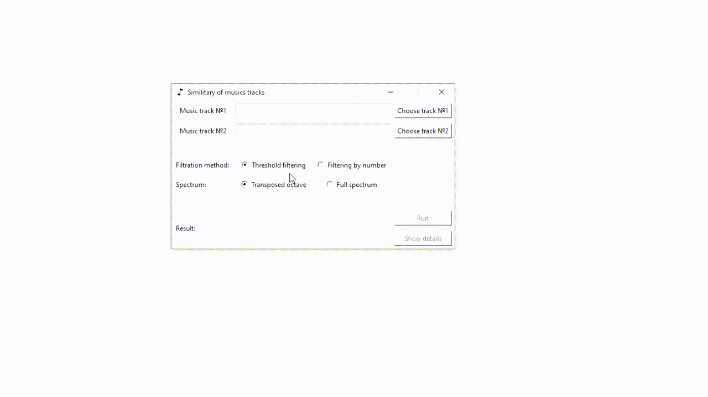

# similarity of music tracks


- [Installation](#anc1)
- [Usage](#anc2)
- [Contribution](#anc3)
- [How It Work](#anc4)
- [Example Of Work](#anc5)
- [License](#anc6)

---
Calculating the value of the metric of similarity between pieces of music.</br>
Implemented by [Python 3.8](https://www.python.org/downloads/).

<a id="anc1"></a>

## Installation
- The sources of application can be downloaded from the [Github repo](https://github.com/rrtty0/similarity_of_music_tracks.git).

* You can either clone the public repository:
```
        $ git clone https://github.com/rrtty0/similarity_of_music_tracks.git 
```
<a id="anc2"></a>

## Usage

To use this project you need:
- _Open_ root-folder with this project at your local computer
- _Run_ file [graphicInterface.py](./graphicInterface.py):
```
        $ python graphicInterface.py
```

<a id="anc3"></a>

## Contribution
1. _Clone repo_ and _create a new branch_:
```
        $ git clone https://github.com/rrtty0/similarity_of_music_tracks.git
        $ git branch name_for_new_branch
        $ git checkout name_for_new_branch
```
2. _Make changes_ and _test_
3. _Submit Pull Request_ with comprehensive description of changes

<a id="anc4"></a>

## How It Work
 - The calculation of the value of the similarity metric of musical compositions occurs by transforming the input music tracks into frequency form using the [discrete Fourier transform](https://en.wikipedia.org/wiki/Discrete_Fourier_transform).
 - Further, the formation of a logarithmic musical spectrum of a musical work takes place, taking into account [the physiology of a person's perception of certain sounds](https://en.wikipedia.org/wiki/Weber–Fechner_law).
 - After the formation of musical spectra of musical works and obtaining the corresponding density of probability distributions for the considered matrices, the [Kullback-Leibler distance](https://en.wikipedia.org/wiki/Kullback%E2%80%93Leibler_divergence) between them is calculated.
 - From the obtained values of the distance, by averaging, the very value of the similarity of musical works is obtained. A more detailed description of the developed algorithm for determining the similarity metric of musical works can be obtained from the author by contacting him by mail: mikhail.chaykin.99@gmail.com.
 - The "music" folder contains pieces of music for testing the developed algorithm.

<a id="anc5"></a>

## Example Of Work


<a id="anc6"></a>

## License
Source Available License Agreement - [MIT](./LICENSE).